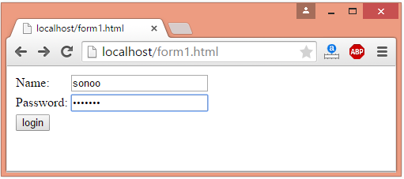
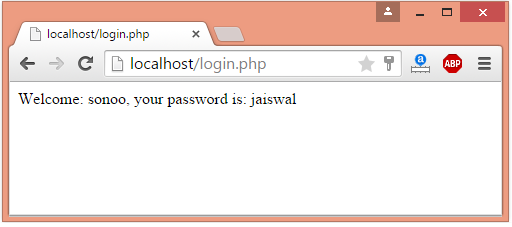

## PHP Form Handling

We can create and use forms in PHP. To get form data, we need to use PHP superglobals $_GET and $_POST.

The form request may be get or post. To retrieve data from get request, we need to use $_GET, for post request $_POST.
HTTP provides two primary methods for submitting data from web forms to the server: POST and GET. Here's a comparison of the two methods, along with their advantages and disadvantages:

### GET Method:

**Advantages:**
1. **Simple URL Parameters:** Data is appended to the URL as parameters. It is easy to understand and implement.
2. **Bookmarking:** As the data is in the URL, users can bookmark the page, and the URL with parameters can be easily shared.

**Disadvantages:**
1. **Security:** Data is visible in the URL, which may pose a security risk, especially when dealing with sensitive information like passwords.
2. **Limited Data:** There is a limit to the amount of data that can be sent via a GET request. This limit is imposed by both browsers and servers.

### POST Method:

**Advantages:**
1. **Security:** Data is not visible in the URL, enhancing security. It's more suitable for sensitive information like passwords.
2. **Data Size:** The amount of data that can be sent is theoretically unlimited (though actual limits may exist on servers).
3. **Data Format:** POST can send different types of data, not just form data. It can be used to upload files and send data in JSON format, for example.

**Disadvantages:**
1. **Complexity:** Implementing a POST request can be more complex than a GET request, especially when dealing with file uploads or sending data in different formats.
2. **Caching:** POST requests are not cached by default. This can be a disadvantage in situations where caching is desirable for performance reasons.


```
+----------------------+----------------+-------------------+
| Aspect               | GET Method     | POST Method       |
+----------------------+----------------+-------------------+
| Data in URL          | Yes            | No                |
| Security             | Less secure    | More secure       |
| Data Size            | Limited        | Theoretically unlimited |
| Bookmarking          | Yes            | No (data not in URL) |
| Caching              | May be cached   | Not cached by default |
| Idempotent           | Yes            | No                |
| Use Cases            | Retrieving data| Modifying data, sensitive information |
+----------------------+----------------+-------------------+
```


### Choosing Between GET and POST:

- **Use GET when:**
  - The request is idempotent (repeating the same request will produce the same result).
  - Data is not sensitive or private.
  - The amount of data is small and fits within URL length limitations.

- **Use POST when:**
  - The request may cause a state change on the server.
  - The data being sent is sensitive or private.
  - The amount of data being sent is large.
  - The request is not idempotent.

In practice, a common approach is to use GET for requests that retrieve data and use POST for requests that modify data on the server.
### PHP Get Form

Get request is the default form request. The data passed through get request is visible on the URL browser so it is not secured. You can send limited amount of data through get request.

Let's see a simple example to receive data from get request in PHP.

```php
<form action="welcome.php" method="get">  
Name: <input type="text" name="name"/>  
<input type="submit" value="visit"/>  
</form>
```

```php
<?php  
$name=$_GET["name"];//receiving name field value in $name variable  
echo "Welcome, $name";  
?>  
```

### PHP Post Form
Post request is widely used to submit form that have large amount of data such as file upload, image upload, login form, registration form etc.

The data passed through post request is not visible on the URL browser so it is secured. You can send large amount of data through post request.

Let's see a simple example to receive data from post request in PHP.

```php
<form action="login.php" method="post">
    <div>
        <label for="name">Name:</label>
        <input type="text" name="name" id="name"/>
    </div>
    <div>
        <label for="password">Password:</label>
        <input type="password" name="password" id="password"/>
    </div>
    <div>
        <input type="submit" value="login"/>
    </div>
</form>

```

```php
<?php  
        $name=$_POST["name"];//receiving name field value in $name variable  
        $password=$_POST["password"];//receiving password field value in $password variable   
        echo "Welcome: $name, your password is: $password";  
?>  
```




**Code as described**
```php

<!DOCTYPE html>
<html lang="en">
<head>
  <meta charset="UTF-8">
  <meta name="viewport" content="width=device-width, initial-scale=1.0">
  <title>Document</title>
</head>
<body>
<form action="06_form_in_php.php" method="post">
    <label for="name">UserName:</label> 
        <input type="text" name="name" id="name">  
    <label for="email">Email:</label> 
        <input type="text" name="email" id="email">
    <label for="password">Password:</label>
        <input type="password" name="pass" id="pass">
    <input type="submit" value = "Login">
</form>
  
<?php  
if($_SERVER['REQUEST_METHOD']== 'POST'){

        $name = $_POST['name'];
        $email = $_POST['email'];
        $password = $_POST['pass'];
        echo "Successfully logged in as $name";
}
?> 
</body>
</html>

```