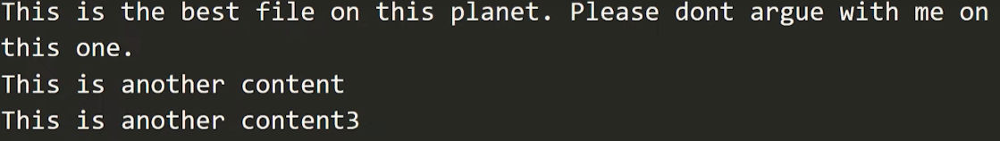
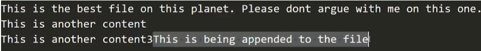

## Introduction

Working with files in PHP involves various operations like reading from files, writing to files, and modifying file contents. PHP provides several functions to perform these operations. Here's an overview of file input/output (I/O) operations in PHP:

### Readfile:

Let's create a text file named mytext.txt and write some sentences in it. Now we will create a php file where we will open and read the mytext.txt file. Now to read the file we need to type

```php
$a = readfile("mytext.txt");
```
Now if you print the value of $a using echo then you will see the sentences you have written and also there is a number at the end of the sentence. The number represents the numbers of characters it has read. Now if you dont want to display the number, then only use

```php
readfile("mytext.txt").
```


Full Code:
```php
<?php

// $a = readfile("myfile.txt");
// echo $a;

// readfile("myfile.txt");
// readfile("1.png");
readfile("file.html");

?>
```

## fopen(), fread() & fclose() in PHP

### Introduction
In our previous tutorials, we have learned to work with files. Now, in this tutorial, we will learn to use fopen(), fread() & fclose() in PHP. So, let's fire up our favorite code editor and start coding.

#### fopen():

fopen() is a PHP function that will open and read lines until the end of the file is reached. To use this function, we need to type $fptr= fopen("myfile.txt", "r");. Now, if we run the file, it will not display anything until we print it. If we print the file pointer, it will show us something like "Resource id is #3". If we use var_dump on echo, It will give us bool(true) if the file we have provided exists and bool(false) if it does not exist.

#### fread():

fread() is a PHP function that will read the content of an open file. This function will stop at the end of the file or when it reaches the specified length, whichever comes first. To use this function, we need to type $fcontent=fread($ptr, value);, Now let me explain what I did there. The fread() function will read the $fptr function in which we have opened the myfile.txt, and then it will read it until the value we have provided. The value should be written in numbers, and PHP will also count spaces. Now to display an entire document, we can use $content = fread($fptr, filesize("myfile.txt"));. So, here filesize("myfile.txt") replaces itself with the entire document value so fread can read the entire document. 

#### fclose():

The fclose() function closes an open file. It has a huge impact on resource management in PHP websites. If we have opened any file, we can close it by just using fclose(), so it does not eat resources when it is not needed. the syntax is: fclose(file). 

Code Example:

```php
<?php

$fptr = fopen("myfile.txt", "r");
// echo var_dump($fptr);
if(!$fptr){
    die("Unable to open this file.Please enter a valid filename");
}
$content = fread($fptr, filesize("myfile.txt"));
fclose($fptr);
echo $content;

?>

```

## Writing and Appending to Files in PHP

### Introduction

In our previous tutorials, we have learned to use fgets and fgetc(). Now, in this tutorial, we will learn to write and append to files in PHP. So, let's fire up our favorite code editor and start coding.

#### Writing to a file in PHP:

We can write to a file in PHP using fopen(). Previously, we used fopen() to open a file; now, we will use fopen() to write into it. We need to change the argument from reading mode to writing mode. So, we will use a file pointer to open a file in write mode. [Note: If we use fopen() a file that does not exist, it will create it, given that the file is opened for writing (w)]. Now w will use fwrite() to write on that file. When we are done writing, we need to close the file using fclose(). For example:

```php
$fptr = fopen("myfile2.txt", "w");
fwrite($fptr, "This is the best file on this planet. Please dont argue with me on this one.\n"); 
fwrite($fptr, "This is another content\n"); 
fwrite($fptr, "This is another content3"); 
fclose($fptr);
```

The output will look like this:



#### Appending to a file in PHP:

To append data on a file in PHP, we need to open the file in Append mode. To open a file in append mode, we need to change the argument in fopen() from w to a. Now we will use fwrite() to add content to the file. Note that append mode adds content from the end of the file, which means the previous content won't be touch when opening in appending form. Now, let's see an example:

```php
// Appending to a file in php
$fptr = fopen("myfile2.txt", "a");
fwrite($fptr, "This is being appended to the file\n"); 
fclose($fptr);
```
Output:



### Difference between the two:

1. **Writing to a File**:
   - When you open a file in "writing" mode (`w`), it creates a new file or overwrites the existing file if it already exists.
   - If the file does not exist, PHP will attempt to create it.
   - If the file already exists, PHP will truncate it, i.e., remove all existing content, before writing new content.
   - It starts writing from the beginning of the file.

   Example:
   ```php
   $file = fopen("example.txt", "w");
   fwrite($file, "This will overwrite existing content or create a new file.");
   fclose($file);
   ```

2. **Appending to a File**:
   - When you open a file in "appending" mode (`a`), it creates a new file if it doesn't exist.
   - If the file already exists, PHP will not truncate it; instead, it will start writing content at the end of the file, preserving existing content.
   - It does not remove or overwrite existing content; instead, it adds new content at the end.

   Example:
   ```php
   $file = fopen("example.txt", "a");
   fwrite($file, "This will add content to the end of the file.");
   fclose($file);
   ```

In summary:
- Writing to a file (`w` mode) overwrites existing content or creates a new file.
- Appending to a file (`a` mode) adds new content at the end of the file, preserving existing content.